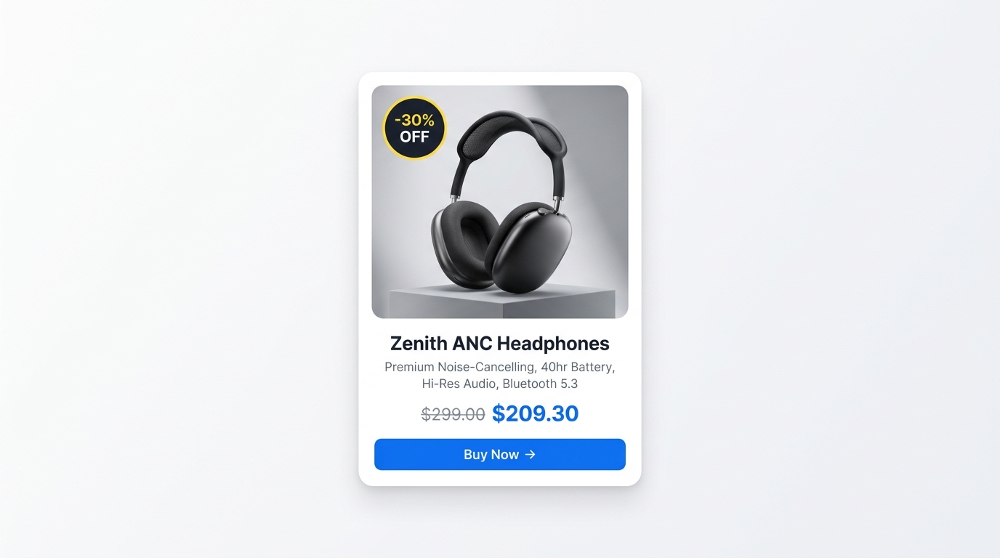
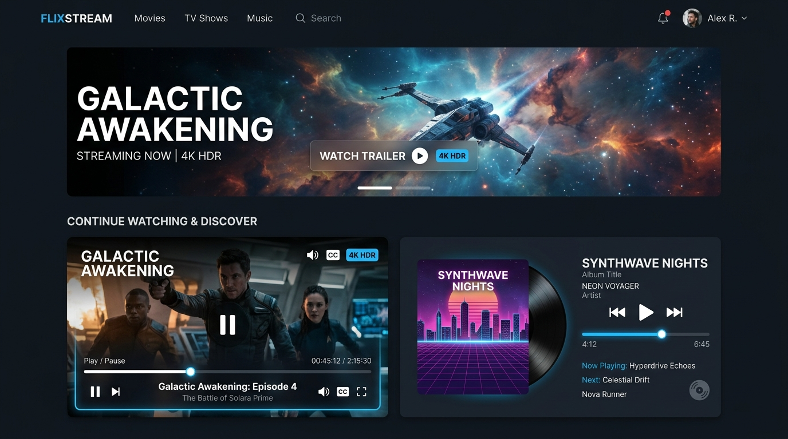
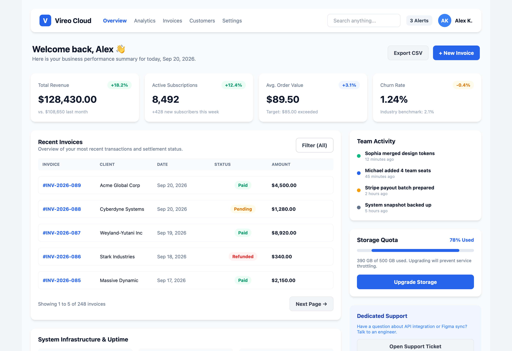
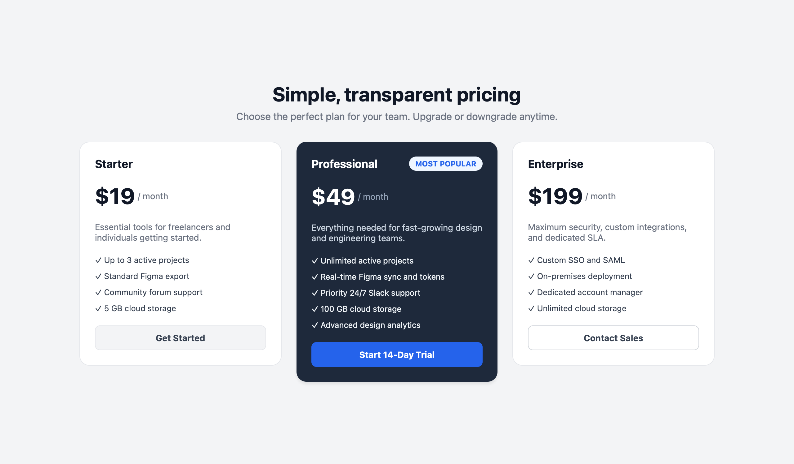

# Design Showcases & Previews

Vireo compiles declarative `.dac` source files into standalone HTML5/CSS Flexbox previews and native Figma Auto Layout components. This page showcases pre-built, production-grade component designs available in the [`showcase/`](https://github.com/DorMiwww/Vireo/tree/main/showcase) directory of the repository.

---

## 1. E-Commerce Product Showcase

Demonstrates high-resolution photography, constraint stack layouts (`layout: stack`) with floating badges, wishlist overlays, dynamic pricing, and action buttons.



### Key Features Demonstrated
- **Stack Layout (`layout: stack`)**: Layered product image with floating `-30% OFF` pill and heart wishlist button.
- **Image Fit Modes**: `fit: cover` with rounded borders (`radius: 14`).
- **Rating Indicators**: Star rating badges with review counts.
- **Color Swatches**: Circular color option selectors with active outline rings.
- **Pricing & Inventory**: Price strike-through, discount pricing, and in-stock badge.

### Source Code (`showcase/product.dac`)
```dac
block Product {
    component Card {
        width: 400
        backgroundColor: #FFFFFF
        radius: 20
        shadow: true
        padding: 20
        layout: vertical
        gap: 16

        component MediaStack {
            layout: stack
            width: 360
            height: 280
            radius: 14

            component ProductImage {
                image: "https://images.unsplash.com/photo-1505740420928-5e560c06d30e?w=800"
                fit: cover
                width: 360
                height: 280
                radius: 14
                zIndex: 1
            }

            component DiscountBadge {
                x: 14
                y: 14
                zIndex: 2
                backgroundColor: #0F172A
                padding: 6 12
                radius: 99
                layout: horizontal
                alignItems: center

                component Text {
                    text: "-30% OFF"
                    fontSize: 12
                    fontWeight: bold
                    color: #FACC15
                }
            }
        }
        // ... additional product details, swatches, and action buttons
    }
}
```

### Compile & Preview
```bash
# Render to standalone HTML preview
vireo render showcase/product.dac --html --out showcase/product.html

# Render to native Figma canvas JSON
vireo render showcase/product.dac --figma --out showcase/product.figma.json

# Open preview in default browser
open showcase/product.html
```

---

## 2. Cinematic Streaming & Media Hub

A comprehensive dark-themed entertainment dashboard demonstrating rich media pipelines, HTML5 video playback, audio soundtrack streaming, and responsive YouTube video embeds.



### Key Features Demonstrated
- **Hero Cinematic Stack (`layout: stack`)**: Background photography overlaid with a dark gradient tint and a floating play CTA.
- **HTML5 Video Player**: `<video>` tag with custom poster, player controls, and rounded border.
- **Audio Stream Player**: Music player with album cover art and native `<audio>` controls.
- **YouTube Embed**: Responsive iframe auto-conversion from standard YouTube watch URLs.

### Source Code (`showcase/media-stream.dac`)
```dac
block Stream {
    component Hub {
        width: 760
        backgroundColor: #0B0F19
        radius: 24
        padding: 32
        layout: vertical
        gap: 24

        component HeroBanner {
            layout: stack
            width: 696
            height: 280
            radius: 16

            component HeroPhoto {
                image: "https://images.unsplash.com/photo-1536440136628-849c177e76a1?w=1000"
                fit: cover
                width: 696
                height: 280
                radius: 16
                zIndex: 1
            }

            component DarkOverlay {
                width: 696
                height: 280
                backgroundColor: #000000
                radius: 16
                zIndex: 2
            }

            component HeroContent {
                x: 32
                y: 40
                width: 460
                zIndex: 3
                layout: vertical
                gap: 12

                component MovieTitle {
                    text: "Chronicles of the Cosmos"
                    fontSize: 24
                    fontWeight: bold
                    color: #FFFFFF
                }
            }
        }
        // ... video card, audio card, and YouTube embed
    }
}
```

### Compile & Preview
```bash
vireo render showcase/media-stream.dac --html --out showcase/media-stream.html
vireo render showcase/media-stream.dac --figma --out showcase/media-stream.figma.json
open showcase/media-stream.html
```

---

## 3. Profile Card with Photographic Header & Avatar

A modern user profile card demonstrating cover photo banners, circular photo avatars, verified checkmark badges, stats grid, and cross-file component imports (`buttons` and `badges`).


### Key Features Demonstrated
- **Cover Photo Stack**: Photographic landscape banner with floating "PRO" membership badge.
- **Circular Photo Avatar**: `fit: cover` with `radius: 99` and contrasting white border ring.
- **Verified Status**: Verified badge icon with inline styling.
- **Modular Imports**: Component referencing via `ref: buttons.Primary.Default` and `ref: badges.Badges.Success`.

### Compile & Preview
```bash
vireo render showcase/card.dac --html --out showcase/card.html
vireo render showcase/card.dac --figma --out showcase/card.figma.json
open showcase/card.html
```

---

## 4. Large SaaS Analytics Dashboard

A full-scale enterprise analytics dashboard showcasing complex nested auto-layouts, metrics tiles, status tables, and navigation sidebars.



### Compile & Preview
```bash
vireo render showcase/dashboard.dac --html --out showcase/dashboard.html
vireo render showcase/dashboard.dac --figma --out showcase/dashboard.figma.json
open showcase/dashboard.html
```

---

## 5. SaaS Pricing Table

A multi-tier pricing table showcasing highlighted recommendation tiers, feature check-lists, and button states.



### Compile & Preview
```bash
vireo render showcase/pricing.dac --html --out showcase/pricing.html
vireo render showcase/pricing.dac --figma --out showcase/pricing.figma.json
open showcase/pricing.html
```
