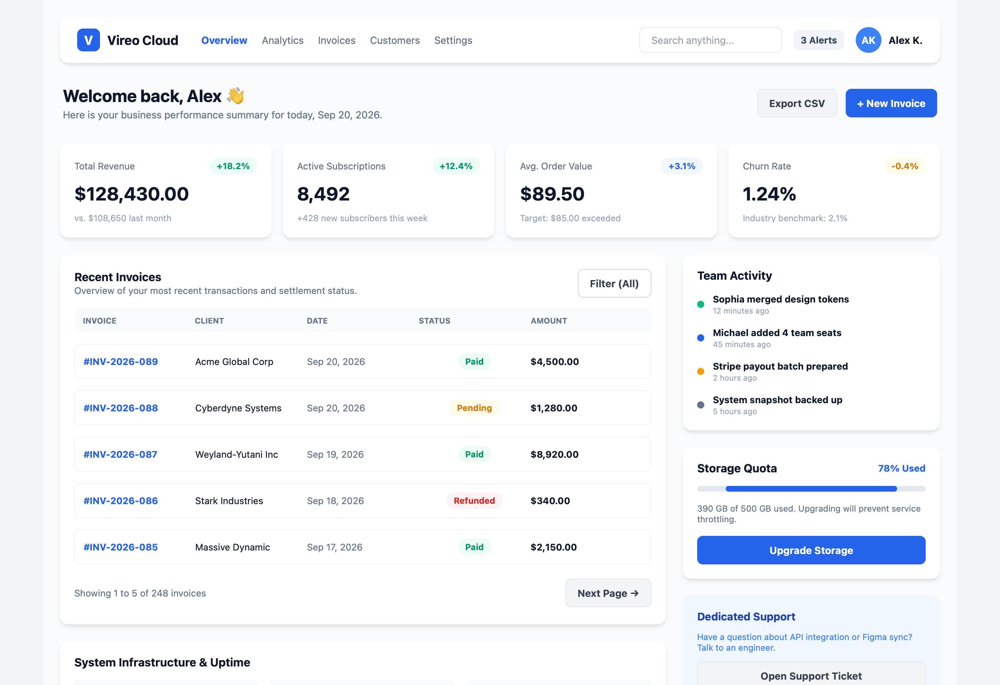
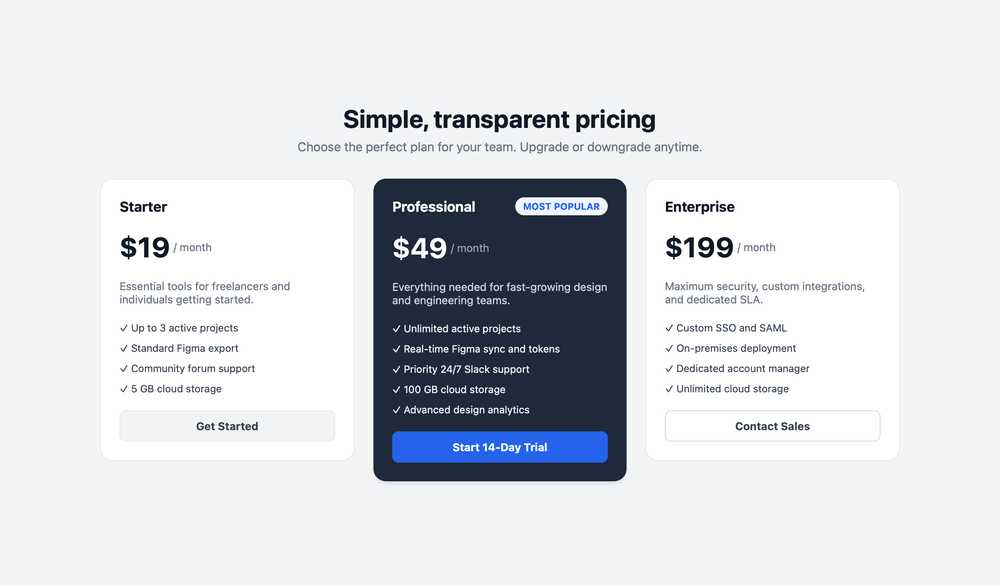

# Vireo

> **Design as Code (DaaC).** Write declarative design files (`.dac`) and compile them into HTML, JSON IR, and native Figma Auto Layout components.

[](https://github.com/DorMiwww/Vireo/actions)
[](https://dormiwww.github.io/Vireo/)
[](https://github.com/DorMiwww/vireo-skill)
[]()
[]()
[]()
[]()

> 📖 **Official Documentation & Live Guide:** [https://dormiwww.github.io/Vireo/](https://dormiwww.github.io/Vireo/)
> 🤖 **Official AI Agent Skill:** [https://github.com/DorMiwww/vireo-skill](https://github.com/DorMiwww/vireo-skill)

Vireo bridges the gap between codebases and design systems. Instead of manually drawing components in Figma and re-implementing them in code, you define your design system in a clean, declarative `.dac` syntax that compiles into:

- **HTML** — Standalone HTML5 previews with native CSS Flexbox styling.
- **JSON IR** — Structured intermediate representation for AST inspection and tooling integrations.
- **Figma** — Real frames, shapes, typography, and Auto Layout structures imported directly into your Figma canvas via the bundled **Vireo Importer** development plugin.

---

## Example Syntax (`.dac`)

```dac
import buttons from "./components/buttons.dac"
import badges from "./components/badges.dac"

block Profile {
    component Card {
        width: 380
        color: #FFFFFF
        radius: 16
        shadow: true
        padding: 24
        layout: vertical
        gap: 16

        component Header {
            layout: horizontal
            gap: 16
            alignItems: center

            component Avatar {
                width: 56
                height: 56
                radius: 99
                color: #2563EB

                component Initials {
                    text: "JD"
                    fontSize: 20
                    fontWeight: bold
                    color: #FFFFFF
                }
            }

            component UserInfo {
                layout: vertical
                gap: 4

                component Name {
                    text: "Jane Doe"
                    fontSize: 18
                    fontWeight: bold
                    color: #111827
                }

                component Handle {
                    text: "@janedoe • Design Systems"
                    fontSize: 13
                    color: #6B7280
                }
            }
        }

        component Bio {
            text: "Design systems architect and UI engineer."
            fontSize: 14
            color: #4B5563
        }

        component ActionBtn {
            ref: buttons.Primary.Default
            label: "Connect"
        }
    }
}
```

---

## Architecture & Modules

Vireo is built as a pure Kotlin (JVM) multi-module project with strict dependency isolation:

```
Vireo
├── vireo-core              # AST model, SourceLocation, Visitor pattern, VireoResult
├── vireo-lexer             # Stateless lexical scanner with token classification
├── vireo-parser            # Recursive descent parser producing unresolved AST
├── vireo-analysis          # Semantic analyzer, symbol table, cross-file imports, expression evaluator
├── vireo-renderer-json     # Structured JSON IR emitter
├── vireo-renderer-html     # Standalone HTML5 + CSS Flexbox generator
├── vireo-renderer-figma    # AST-to-Figma schema transformer
├── vireo-cli               # CLI interface (vireo init, vireo check, vireo render)
└── figma-plugin            # Native Figma development plugin (JS/HTML) for canvas import
```

Data compilation pipeline:
```
.dac source ──▶ [ Lexer ] ──▶ [ Parser ] ──▶ [ Analyzer ] ──▶ [ Renderer ] ──▶ HTML / JSON / Figma
```

---

## Getting Started

### Prerequisites
- JDK 17+ (JDK 21 recommended)
- Gradle (handled automatically via `./gradlew`)
- Node.js (optional, for the Figma plugin)

### Build & Test
```bash
./gradlew test
```

### Installing & Running the CLI

#### One-Line Installer (macOS & Linux)
```bash
curl -fsSL https://raw.githubusercontent.com/DorMiwww/Vireo/main/install.sh | bash
```

#### From Source / Repository
```bash
./gradlew installCli
# Or run the local repository wrapper directly:
./vireo --help
```

### AI Agent Skill (Claude Code & Antigravity)

Vireo provides an official AI agent skill for **Claude Code** and **Google Antigravity**: [**`DorMiwww/vireo-skill`**](https://github.com/DorMiwww/vireo-skill). It equips coding assistants to professionally author, refactor, and architect `.dac` design systems using live, dynamically fetched documentation.

Install globally with a single command:
```bash
curl -fsSL https://raw.githubusercontent.com/DorMiwww/vireo-skill/main/install.sh | bash
```

👉 Repository & documentation: **[https://github.com/DorMiwww/vireo-skill](https://github.com/DorMiwww/vireo-skill)**

---

## CLI Usage

The Vireo CLI features a `kubectl`-style ergonomic interface with built-in help for each subcommand:

### 1. Initialize a New Project (`vireo init`)
Scaffold a complete ready-to-render design system in seconds:

```bash
# Initialize a new project in directory 'my-design'
vireo init my-design

# Or initialize in the current directory
vireo init .
```

This creates:
- `vireo.config.json` — project configuration
- `designs/tokens.dac` — colors, spacing, and typography tokens
- `designs/components/button.dac` — reusable component definitions
- `designs/card.dac` — full composition showcasing token and component imports
- `README.md` — project instructions

### 2. Syntax & Import Validation (`vireo check`)
Verify syntax, resolve cross-file imports, and catch semantic errors:

```bash
vireo check designs/card.dac
```

### 3. Compiling & Rendering (`vireo render`)
Render `.dac` designs into HTML previews, JSON AST representations, or Figma-ready schema files. By default, output files are created automatically based on input file names:

```bash
# Render to standalone HTML5 preview (automatically creates card.html)
vireo render designs/card.dac --html

# Render to Figma JSON for the Figma Canvas Plugin (automatically creates card.figma.json)
vireo render designs/card.dac --figma

# Stream output directly to terminal stdout (or pipe to other tools)
vireo render designs/card.dac --html --stdout
vireo render designs/card.dac -o -

# Render HTML snippet to custom file (without full HTML wrapper)
vireo render designs/card.dac --html --snippet --out card-snippet.html

# Render to structured JSON IR (AST representation)
vireo render designs/card.dac -o json
```

For a full list of options, run:
```bash
vireo render --help
```

---

## Figma Integration

Vireo includes a private development plugin located in [`figma-plugin/`](figma-plugin/):

1. Open **Figma Desktop**.
2. Navigate to **Plugins** → **Development** → **Import plugin from manifest...**
3. Select [`figma-plugin/manifest.json`](figma-plugin/manifest.json).
4. Run **Vireo Importer** on your canvas.
5. Choose an optional device canvas preset (*Desktop Browser*, *Laptop*, *iPhone 16*, *iPad*, or *None*).
6. Drag & drop or paste your generated `*.figma.json` file.
7. Click **Import to Canvas** — native Auto Layout frames, text layers, colors, and paddings are rendered directly onto your Figma canvas.

---

## Showcase Designs & HTML Previews

Vireo compiles declarative `.dac` files directly into pixel-perfect standalone HTML5/CSS Flexbox previews. Below are previews of ready-to-test components available in the [`showcase/`](showcase/) directory:

### 1. Large SaaS Analytics Dashboard ([`showcase/dashboard.dac`](showcase/dashboard.dac))
Complete responsive analytics dashboard featuring navigation, hero greetings, key performance metrics, data tables with pagination, and interactive sidebars.



---

### 2. SaaS Pricing Table ([`showcase/pricing.dac`](showcase/pricing.dac))
Multi-tier comparative pricing table with highlight badges, feature lists, and action buttons.



---

### 3. Profile Card ([`showcase/card.dac`](showcase/card.dac))
User profile component demonstrating nested Auto Layout, avatar typography, followers metrics grid, and tag chips.

<p align="center">
  
</p>

You can preview the pre-rendered HTML files directly in your browser:
```bash
open showcase/dashboard.html
# or
open showcase/pricing.html
# or
open showcase/card.html
```

---

## Documentation

Full developer documentation, component catalogue, language syntax, and layout specifications are available online:

👉 **[https://dormiwww.github.io/Vireo/](https://dormiwww.github.io/Vireo/)**

Source markdown documentation files are maintained in the [`DOCS/`](DOCS/) directory:
- [Getting Started](https://dormiwww.github.io/Vireo/getting-started)
- [Core Concepts & Addressing](https://dormiwww.github.io/Vireo/concepts/)
- [Component Model & Properties](https://dormiwww.github.io/Vireo/components/)
- [Auto Layout & Constraints](https://dormiwww.github.io/Vireo/layout)
- [Renderers (HTML, JSON AST, Figma)](https://dormiwww.github.io/Vireo/renderers/)
- [CLI Reference Manual](https://dormiwww.github.io/Vireo/cli)
- [Figma Plugin Guide](https://dormiwww.github.io/Vireo/figma-plugin)

---

## Roadmap

- [x] **Phase 1**: Core AST, Stateless Lexer & Recursive Descent Parser
- [x] **Phase 2**: Cross-file Imports (`import ... from`), Layout Constraints & HTML5/CSS Flexbox Renderer
- [x] **Phase 3**: Variables, Function Definitions, Arithmetic Expressions, and Conditionals (`if ... then ... else`)
- [x] **Phase 4**: Figma Schema Renderer (`vireo-renderer-figma`)
- [x] **Phase 4.5**: Native Figma Canvas Plugin (`figma-plugin/`) with Auto Layout & Device Canvas Presets
- [x] **Phase 5**: Interactive Project Scaffolding & CLI Ergonomics (`vireo init`, `kubectl`-style flags)
- [ ] **Homebrew Distribution**: `brew install dormiwww/tap/vireo`
- [ ] **Backlog**: Figma Design Bundle & Canvas Orchestrator (`vireo bundle`)

---

## Contributing & Agent Rules

Project guidelines, syntax references, architecture decision records, and agent skills are organized under [`.agents/`](.agents/):
- **Rules & Architecture**: [`.agents/rules/AGENTS.md`](.agents/rules/AGENTS.md)
- **Roadmap & Context**: [`.agents/rules/ROADMAP.md`](.agents/rules/ROADMAP.md), [`.agents/rules/CONTEXT.md`](.agents/rules/CONTEXT.md)
- **Agent Skills**: [`.agents/skills/`](.agents/skills/)
- **Official AI Skill Repository**: [`DorMiwww/vireo-skill`](https://github.com/DorMiwww/vireo-skill)

---

## License

[MIT License](LICENSE)